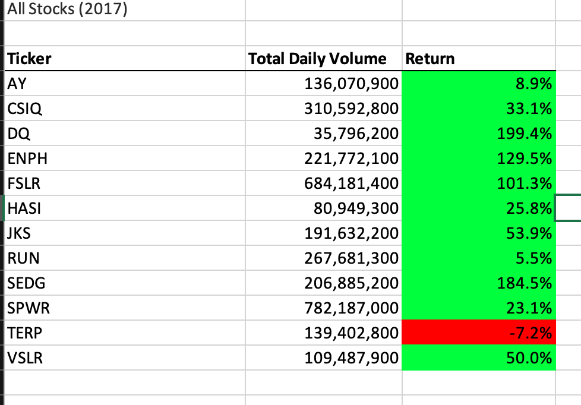
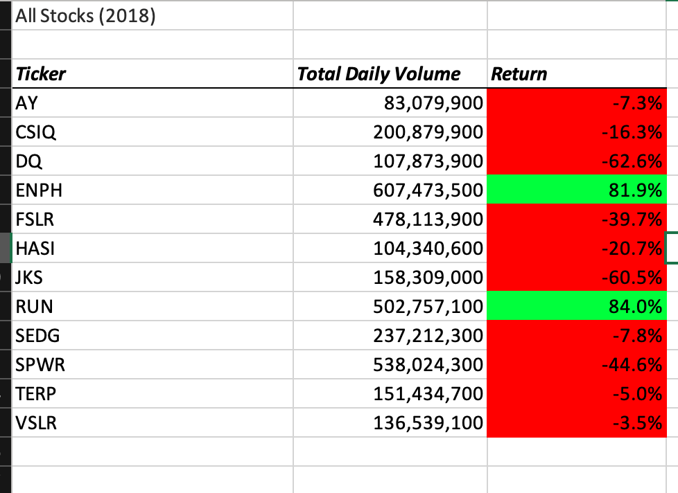
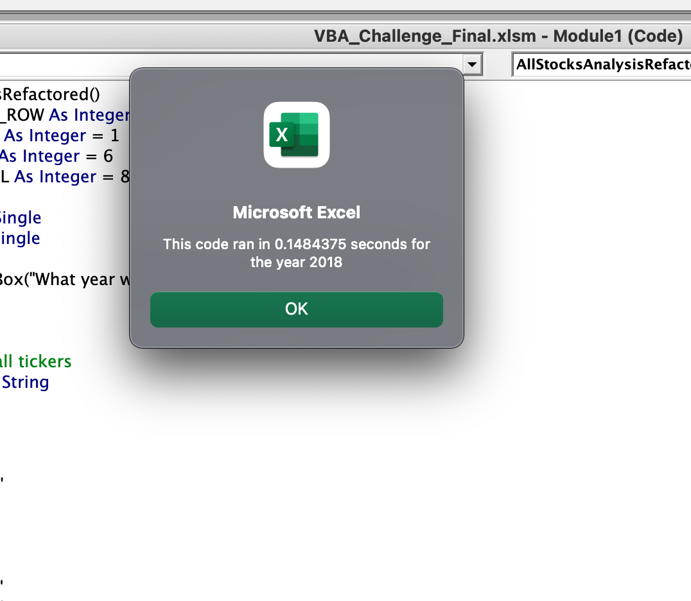
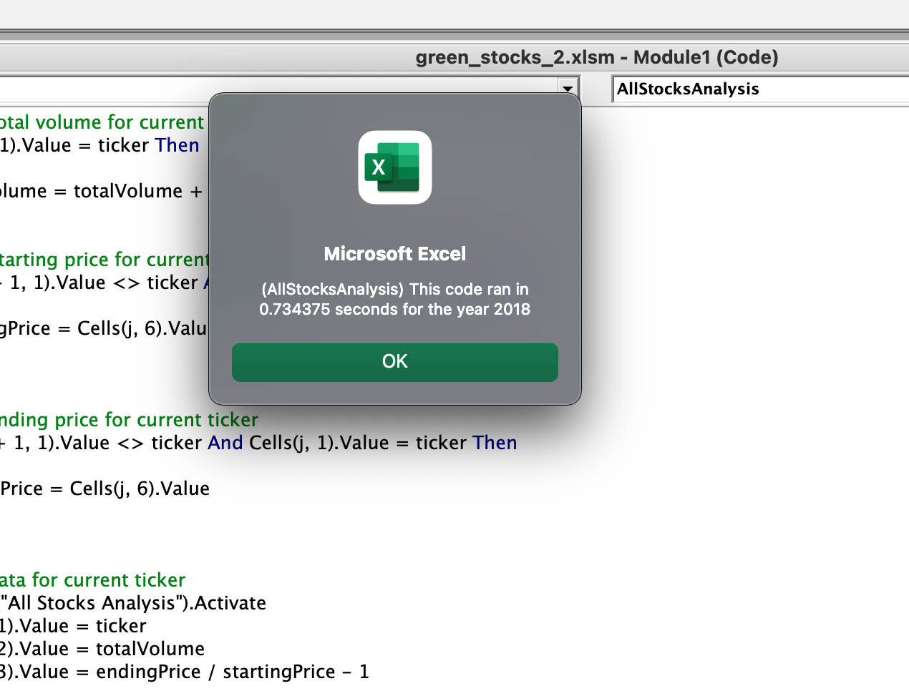

# Stock Analysis

## Overview

We are interested in researching investment opportunities in green energy. Using Excel and Macros, we analyzed 12 stocks over the course of 2017 and 2018.

## Results

In 2017, Only one stock had a negative return: TERP

In 2018, only two stocks had a positive return: ENPH and RUN.

## Conclusion

Stock prices are volatile; a good year may be followed by a bad one. More data is needed to draw any conclusions.

## Code Refactoring

After refactoring the code, it ran more quickly

