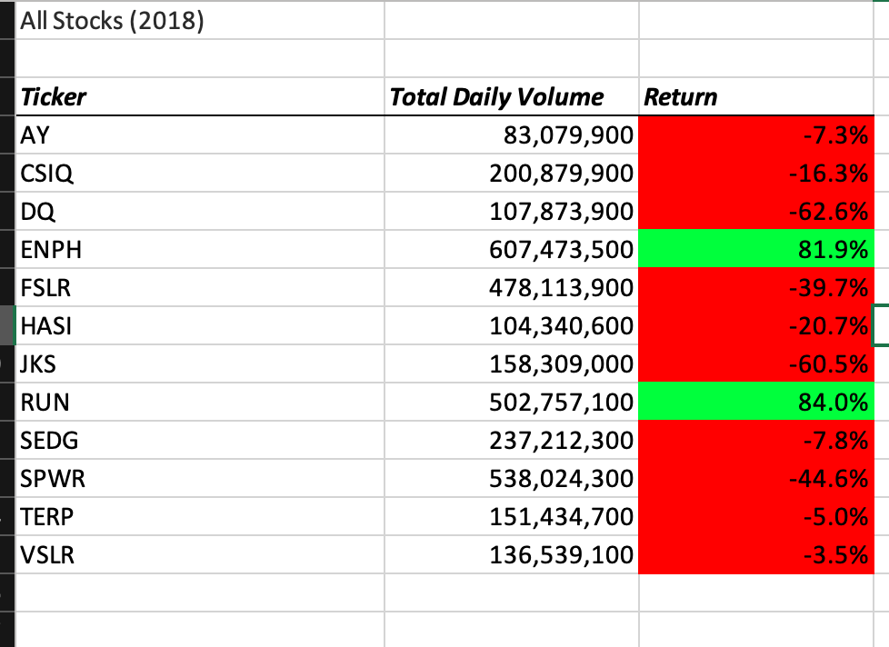

# Stock Analysis

## Overview

We are interested in researching investment opportunities in green energy. Using Excel and Macros, we analyzed 12 stocks over the course of 2017 and 2018.

## Results

In 2018, only two stocks had a positive return: ENPH and RUN.

 